# SiteTwin Data Flow - Beginner Guide

Related: [[SiteTwin Project Hub]], [[Architecture Baseline]], [[Firmware Architecture]], [[Gateway and Data Flow]], [[Pod and Sensor Strategy]], [[Validation and Implementation Plan]]

## The Whole System in One Sentence

A battery pod measures something, decides whether the measurement is worth transmitting, sends a
small binary message over Zigbee, and the powered gateway checks it, gives it readable names, turns it
into JSON, and later sends it over Wi-Fi to the Raspberry Pi.

## The Three Main Parts

### 1. The pods

The pods are small battery-powered sensor computers. There are three planned pod types:

- Environment pod: temperature, humidity, CO2, and VOC
- Activity and access pod: motion, door contact, and light level
- Equipment pod: vibration, surface temperature, current, and voltage

The pods need to save battery. They should do as little work and transmit as little data as possible.

### 2. The gateway

The gateway listens to all the pods. It is powered continuously, so it can do more processing. It
checks messages, rejects duplicates, keeps important events ahead of routine readings, creates JSON,
and will manage Wi-Fi and MQTT delivery.

The preferred gateway has two chips:

- one chip concentrates on Zigbee
- one chip concentrates on Wi-Fi, MQTT, buffering, and heavier gateway work

A one-chip gateway may still be tested, but Zigbee and Wi-Fi would share one radio and could interfere
with each other.

### 3. The Raspberry Pi

The Raspberry Pi is the long-term computer. It will store data, run dashboards, measure reliability,
and later perform digital-twin or machine-learning work. It is not part of the battery-saving firmware.

## The Complete Data Journey

```mermaid
flowchart LR
    A["Physical sensor"] --> B["Sensor driver"]
    B --> C["Sensor registry"]
    C --> D["Pod reporting policy"]
    D -->|"Worth sending"| E["Pod priority queue"]
    D -->|"No meaningful change"| X["Reading suppressed"]
    E --> F["30-byte Zigbee payload"]
    F --> G["Zigbee radio"]
    G --> H["Gateway Zigbee receiver"]
    H --> I["Gateway address book"]
    I --> J["Decode and validate"]
    J --> K["Reject duplicate or stale data"]
    K --> L["Gateway delivery queue"]
    L --> M["JSON conversion"]
    M --> N["MQTT over Wi-Fi"]
    N --> O["Raspberry Pi storage and dashboard"]
```

The boxes up to the gateway delivery queue are implemented as portable C logic and tested on the
computer. The physical sensors, radio calls, MQTT connection, and Raspberry Pi services are still
future integration work.

## A Temperature Example

Imagine the Environment pod reads `21.5 C`.

1. The sensor driver asks the temperature sensor for a value.
2. The sensor registry adds useful information such as sequence number, boot ID, sensor type, and
   quality flags.
3. The reporting policy compares `21.5 C` with the last transmitted temperature.
4. If the previous transmitted value was `21.4 C`, the `0.1 C` difference is below the current
   `0.2 C` deadband, so the pod does not queue or transmit it.
5. If the value becomes `21.7 C`, the change reaches the deadband. Once the minimum report interval
   has passed, the record is placed in the pod queue.
6. The Zigbee codec compresses the useful fields into a fixed 30-byte payload.
7. The gateway receives the payload and uses the Zigbee address plus sensor slot to recover names such
   as `ENV_01` and `env_temperature`.
8. The gateway rejects the message if it is malformed, duplicated, or older than one already accepted.
9. An accepted record waits in the gateway delivery queue.
10. The gateway creates readable JSON for MQTT and the Raspberry Pi.

The pod also sends a heartbeat after the maximum-silence interval. This means an unchanged room still
occasionally says "I am alive."

## What Is Inside the 30-Byte Zigbee Message?

The message contains numbers, not JSON and not repeated names. It includes:

- payload version
- type of record, such as state or event
- delivery priority
- sensor type and measurement unit
- sensor slot number
- quality flags
- sequence number
- boot ID
- pod uptime
- measured value

The gateway stores the readable names. For example, it can know that Zigbee sensor slot `0` on pod
`ENV_01` means `env_temperature`. Avoiding repeated strings makes every radio transmission smaller.

## Three Different Message Formats

These formats have different jobs and should not be confused:

| Format | Where it is used | Why it exists |
| --- | --- | --- |
| 30-byte Zigbee payload | Pod to gateway over Zigbee | Small and battery-friendly |
| UART frame with CRC16 | Between two gateway chips, if the dual-chip design is used | Detects corruption and keeps the internal link structured |
| JSON | Gateway to Raspberry Pi over MQTT and Wi-Fi | Human-readable and easy to store or display |

In a single-chip gateway, the UART step disappears. The same chip receives Zigbee and runs the gateway
processing logic.

## What Each Firmware File Does

Think of the firmware as a team in which every file has one job.

### Shared language

`contracts.h` is the dictionary. It defines what a reading and telemetry record look like, the sensor
types, units, priorities, and quality flags. Other files include this dictionary so they all use the
same meanings.

### Pod side

`sensor_driver.h` defines the plug shape for a sensor driver. Every real or fake sensor must provide a
`probe` function and a `sample` function.

`sensor_registry.c` is the sensor manager. It asks whether sensors exist, handles warming up or faults,
requests samples, and creates complete readings.

`reporting_policy.c` is the battery-saving decision maker. It decides whether a routine reading changed
enough to transmit and ensures occasional heartbeats still happen.

`telemetry_queue.c` is the pod waiting line. Important events go first. A newer routine state can replace
an older unsent state from the same sensor.

`pod_runtime.c` is the pod coordinator. It calls the registry, converts readings into telemetry records,
asks the reporting policy for permission, and places accepted records in the queue.

`zigbee_payload.c` is the compact translator. It changes a telemetry record into 30 bytes and can turn
those 30 bytes back into a telemetry record.

### Gateway side

`gateway_registry.c` is the address book. It maps a stable Zigbee IEEE address and its current short
address to a pod name. It also maps each sensor slot to a sensor name.

`gateway_processor.c` is the checker. It validates records and rejects duplicate or stale sequence
numbers.

`gateway_runtime.c` is the gateway coordinator. It joins address lookup, decoding, checking, priority
queueing, and JSON delivery into one callable pipeline.

`gateway_json.c` creates the readable JSON used at the MQTT boundary.

`gateway_frame.c` creates and checks the CRC-protected UART envelope for a possible two-chip gateway.
It is not the Zigbee payload.

### Test and startup files

`fake_sensor.c` pretends to be physical hardware. Tests can make it warm up, change value, disappear,
or fail.

`test_runner.c` sends controlled and randomized situations through the firmware and checks the results.

`run-tests.ps1` tells GCC which C files to compile and then runs the test program.

`app_main.c` will become the real ESP-IDF starting point. It is currently small because real board,
sensor, Zigbee, and FreeRTOS task adapters have not been added yet.

## How `.h` and `.c` Files Link Together

A `.h` file is a promise. It tells other files, "this function or data type exists, and this is how to
use it."

A `.c` file contains the actual work that fulfils the promise.

For example:

1. `gateway_runtime.h` announces that `st_gateway_runtime_ingest_zigbee_source` exists.
2. `gateway_runtime.c` contains the code for that function.
3. A future ESP Zigbee adapter will include `gateway_runtime.h` and call the announced function when a
   radio message arrives.
4. CMake, or the host test PowerShell script, gives all required `.c` files to the compiler.
5. The compiler and linker connect each function call to its implementation.

An `#include` does not run another file. It gives the compiler the definitions and promises needed to
understand the current file.

## Are We Still Using Threads?

Yes, but ESP-IDF calls them FreeRTOS tasks. The final firmware will use separate tasks so slow Wi-Fi or
sensor work does not block important Zigbee events.

Likely pod tasks:

- sensor acquisition
- pod management and power scheduling
- telemetry and Zigbee transmission
- a fast vibration path on the Equipment pod

Likely gateway tasks:

- Zigbee receive and coordinator work
- validation and processing
- persistent buffering
- Wi-Fi and MQTT delivery

The portable code does not create these tasks yet. That is deliberate: ordinary functions are easier to
test on the computer. Later, the FreeRTOS tasks will repeatedly call these already-tested functions and
pass records through bounded queues.

## What Happens When Something Goes Wrong?

- Unchanged value: the pod suppresses it to save energy.
- Important event: it bypasses suppression and receives high queue priority.
- Duplicate Zigbee message: the gateway discards the extra copy.
- Old message: the gateway marks it stale and discards it.
- Pod reboot: a new boot ID starts a new sequence session.
- Zigbee short address changes: the stable IEEE address lets the gateway recognize the same pod.
- Wi-Fi fails: the planned persistent gateway buffer will retain important data for retry.
- Gateway queue fills: events are protected ahead of lower-priority routine state, but saturation is
  counted so it cannot fail silently.

## What Is Real Today?

Implemented and host-tested today:

- sensor contracts, fake drivers, and sensor lifecycle logic
- reporting suppression, deadbands, intervals, and heartbeats
- pod and gateway priority queues
- 30-byte Zigbee encode and decode logic
- gateway node and sensor-slot address book
- validation, duplicate rejection, and stale rejection
- JSON conversion and CRC-protected gateway framing
- randomized stress testing

Still simulated or planned:

- electrical sensor communication
- real Zigbee network formation, joining, security, and radio transmission
- ESP-IDF FreeRTOS task creation
- deep sleep and physical power measurements
- MQTT connection, persistent outage buffering, and Wi-Fi recovery
- Raspberry Pi storage, dashboard, and ML services

Passing computer tests prove that the decision logic behaves correctly in simulation. They do not yet
prove radio range, real-time performance, electrical reliability, or battery life.

## Recommended Next Steps Before Hardware

1. Build MQTT batching with a fake MQTT sender.
2. Build persistent outage buffering behind a fake storage interface.
3. Design Zigbee joining, allow-listing, and sensor-slot registration messages.
4. Define acknowledgements for important events and remote commands.
5. Add heartbeat monitoring and offline-pod detection at the gateway.
6. Fuzz the decoder with random and damaged payloads.
7. Run long simulated outages, restarts, duplicate bursts, and message reordering.
8. Install and pin ESP-IDF and the ESP Zigbee SDK before writing the thin hardware adapter.

For exact structures and engineering details, continue with [[Firmware Architecture]]. For gateway
topics and MQTT boundaries, continue with [[Gateway and Data Flow]].
